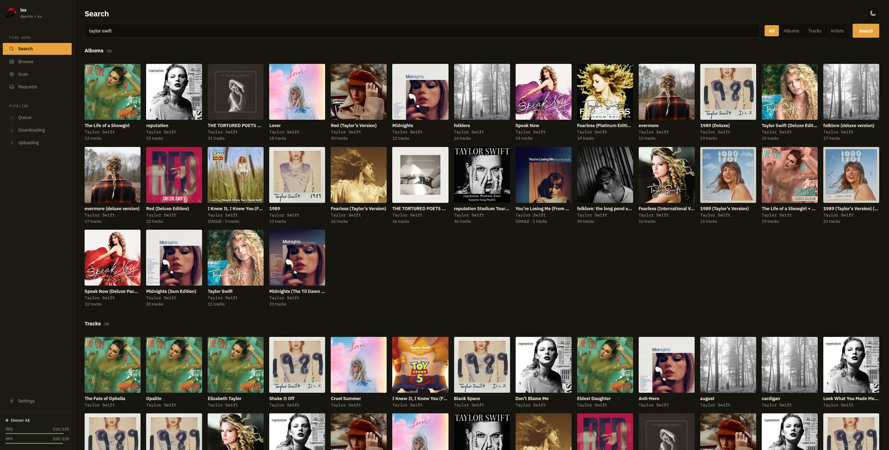
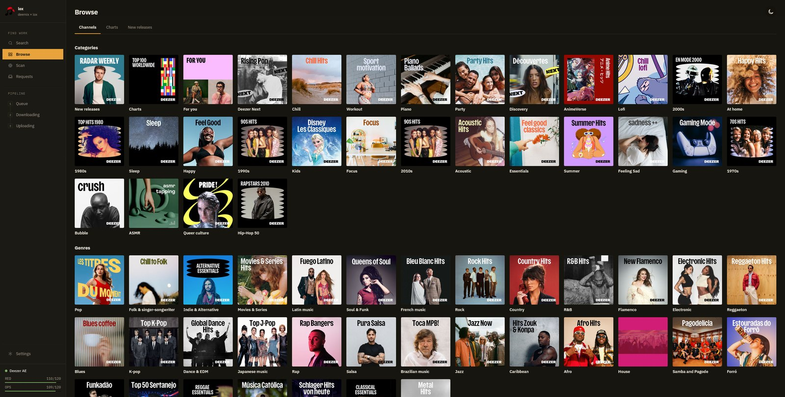
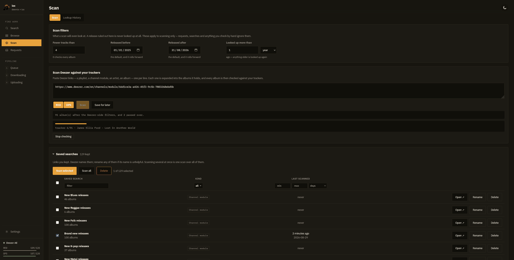
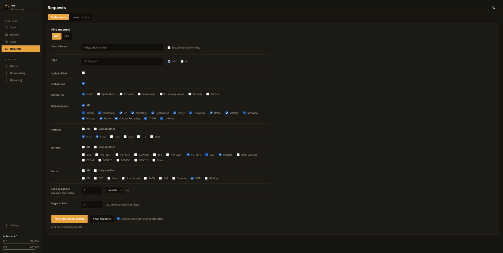
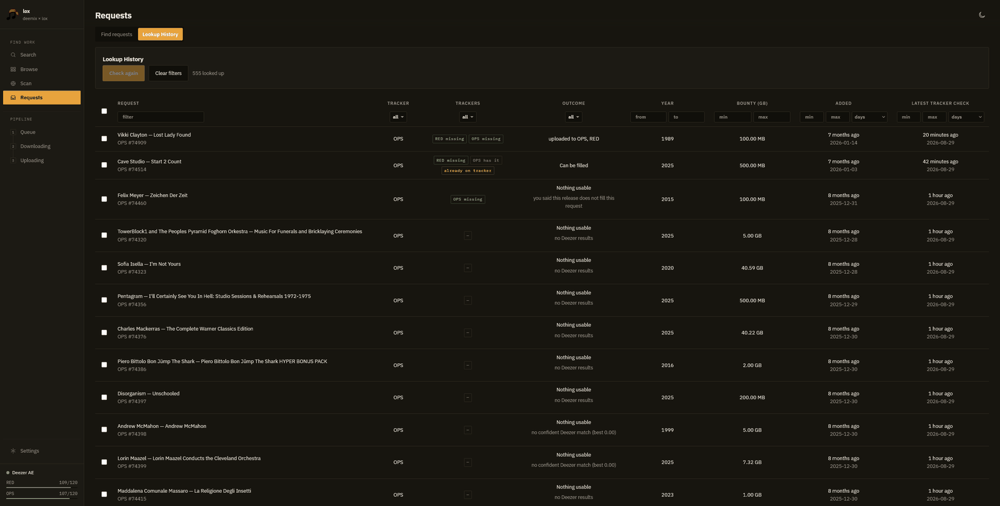
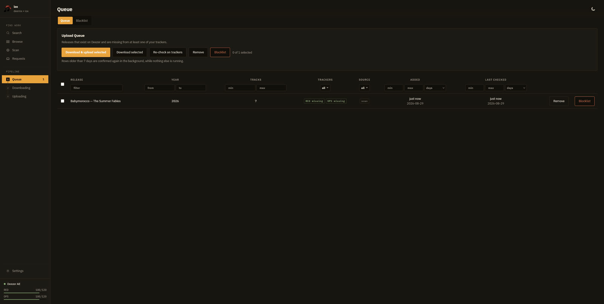
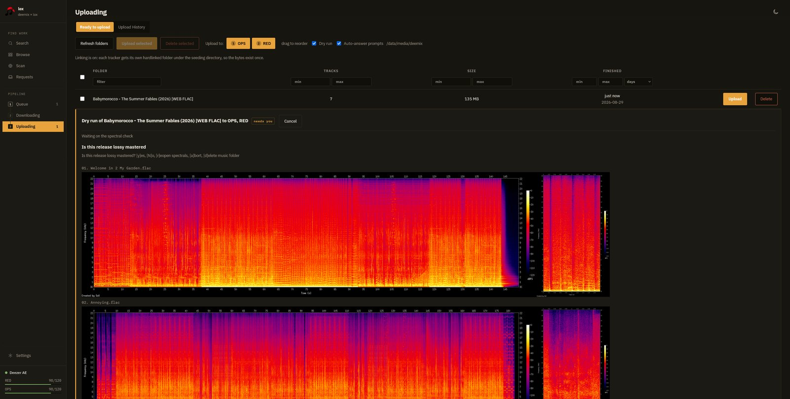
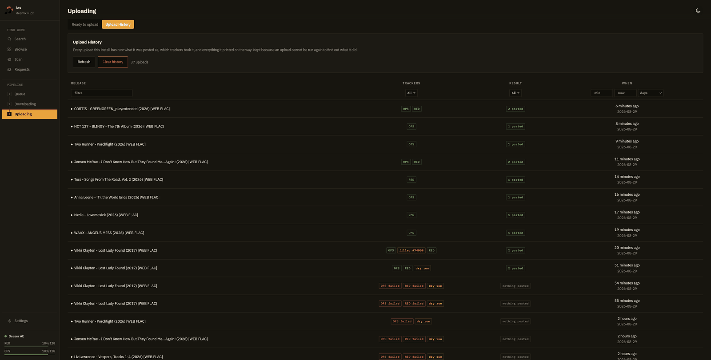

# Lox

**A Deezer-to-Gazelle upload pipeline with a web UI.** Find a release on Deezer, check whether RED and OPS already
have it, download it in FLAC, and upload it to whichever trackers are missing it — without leaving the browser.

> [!WARNING]
> **This project was built with AI.** Most of this codebase was written with heavy help from an LLM and has had no
> external review. It holds a Deezer session credential, spends your tracker API budget, and posts to your tracker
> accounts. Read the code before you point it at an account you care about, run it on infrastructure you control,
> and do not expose it to the internet.



**[Read the documentation →](https://github.com/MonkeyGoneWIld/Lox/wiki)**

---

## Overview

Lox sits between Deezer and your Gazelle trackers. It searches and browses Deezer, asks the trackers whether they
already have a release, downloads what they are missing in FLAC, and runs it through the full upload pipeline —
tagging, spectrals, descriptions, `.torrent` creation, per-tracker hardlinks, and the post itself.

Four ways to find work — Search, Browse, Scan, Requests — feed one three-stage pipeline: **Queue → Downloading →
Uploading**. One release is prepared once and offered to every tracker that wants it.

> [!IMPORTANT]
> **Trackers are only contacted when you press a button that says so.** RED and OPS have small API budgets and punish
> bursts with hours-long lockouts, so every tracker call goes through one gateway that spends from a token bucket,
> spaces calls apart, and benches a tracker after repeated failures. The remaining budget per tracker is shown in the
> sidebar at all times. Search, Browse, album metadata, FLAC checks and downloads never touch a tracker at all.

---

## Features

### Find work

**Search Deezer** for an album, track or artist, and check any result against your trackers from the page it appears
on.

**Browse** Deezer channels, charts by genre, and editorial new releases. Channels are read out of the page's
`__DZR_APP_STATE__`, which is the surface deemix never exposed. Any channel module can be sent to the Scan tab with
one click.



**Scan** re-runnable saved searches — new releases by genre, a chart, an album search, an artist's discography, a
playlist, or a channel module. Expanding them is free; only the tracker check costs budget. Scan filters (minimum
track count, release date window, how long an answer stays trusted) rule releases out before any tracker is contacted.



**Requests** — search open requests on RED or OPS with per-tracker filters, then look each one up on Deezer
automatically. Both trackers run Gazelle and both search pages look identical, but the parameter names and the numeric
IDs behind the labels differ, so lox keeps one filter vocabulary per tracker rather than one shared table that would
quietly search for the wrong thing.



Every lookup is kept with its outcome, so you can see what matched, what was rejected, and why.



### Checking

- **Shows its work.** A check reports the torrent groups it *rejected* and why — title mismatch, artist mismatch, no
  WEB FLAC in the group — each one a link you can open. A "missing" verdict is only trustworthy if you can see what it
  looked at.
- **Independent gates for request fills.** Artist score ≥ 0.50, title score ≥ 0.40, combined ≥ the minimum confidence,
  exact track count, every track streamable in your region, and all-lossless when the request is FLAC-only. A great
  artist score cannot rescue a poor title score, because filling a request with the wrong edition is worse than not
  filling it.
- **Track counts cross-checked** against Discogs, MusicBrainz, Bandcamp, Beatport, Qobuz, Tidal, Apple Music and
  Metal-Archives, so a deluxe edition does not get posted against a standard-edition request.
- **Budgeted and breakered.** A scan that would overdraw the budget stops early and keeps its place rather than
  blowing the limit.
- **Background re-confirmation.** A queue row says nobody has uploaded the release yet, and that stops being true
  without anyone telling you. Rows past a configurable age are confirmed again in the background, one at a time, and
  only while nothing else is running.

### The pipeline

**Queue** holds everything a check found to be missing, with a rule deciding which of it is worth acting on — missing
from any tracker, from every tracker, from one named tracker, or missing from one and already on the others. The rule
is applied when the queue is drawn, so widening it brings rows straight back: nothing is re-checked and nothing was
thrown away. A blacklist keeps releases you have decided against from coming back on the next scan.



**Downloading** happens in-process with an ARL set: stream URLs resolved through Deezer's media API, the
Blowfish-striped payload decrypted as it streams, tags and cover art written from the Deezer metadata. The result is a
plain release folder the upload flow already understands.

**Uploading** runs the pipeline once per release and offers it to every tracker that is missing it — one transcode,
one set of spectrals, one `.torrent` per tracker. Prompts that need a human, like the lossy-master question, appear in
the console and are answered there.



Every upload is kept in a history with what it posted, which trackers took it, and everything it printed on the way —
because an upload cannot be run again to find out what it did.



### Hardlinked per-tracker folders

Uploading one release to two trackers needs two torrents pointed at two paths. Rather than keep two copies, lox
hardlinks — the same thing cross-seed does:

```
/links/
├── RED/
│   └── Ana Vidal - Nocturne Variations (2026) [WEB FLAC]/
│       ├── 01. Nocturne I.flac    → hardlink
│       └── cover.jpg              → hardlink
└── OPS/
    └── Ana Vidal - Nocturne Variations (2026) [WEB FLAC]/
        ├── 01. Nocturne I.flac    → hardlink
        └── cover.jpg              → hardlink
```

A 500 MB release costs 500 MB no matter how many trackers it goes to. Point qBittorrent at `/links` and both torrents
seed from their own directory. The seedbox entry that injects into your torrent client is tracker-aware: set
`tracker = "RED"` to restrict an entry to one tracker, and use `{tracker}` in `directory` and `label` so one entry
serves both with the right save path and category.

> [!WARNING]
> **Hardlinks cannot cross filesystems.** The seeding directory must be on the same volume as your downloads. If it is
> not, lox fails loudly rather than silently making real copies — unless you turn on *fall back to a real copy*.

### Dry run

Everything runs — tagging, renaming, spectral generation, cover handling, description assembly, hardlinking,
`.torrent` creation — except the steps you cannot take back:

| Step | Dry run |
|---|---|
| Post the torrent to the tracker | skipped, prints the payload it would have sent |
| Fill a request | skipped |
| File a lossy-master report | skipped |
| Edit a torrent description | skipped |
| Transfer to seedbox / add to download client | skipped, prints the save path and category it would have used |
| Upload cover art and spectrals to an image host | skipped, stand-in links on `dry-run.invalid` |

The downconversion output is **kept** and listed with a Delete button rather than removed before you can look at it,
and descriptions are printed in full rather than summarised as a character count — reading them is the point of
rehearsing.

### Settings, all in the UI

82 settings across 16 sections, grouped into Accounts, Uploading, Files and Maintenance, applied without a restart.
Sixteen of them can be tested against the real service rather than checked for being non-empty: the Deezer ARL
(including whether the account holds a streaming licence), each tracker's credentials, the seeding layout (by making a
real hardlink and comparing inodes), every torrent client, the Discord webhook, every path, and each image-host and
metadata-source key on its own.

### Everything else

- **Configuration that is wrong does not stop startup.** lox comes up, shows a banner naming what is wrong, and the
  operations that need the setting refuse with a message pointing at it — because a container that restart-loops over
  a path you could have fixed in the UI is worse than one that starts and tells you.
- **First-run account setup.** The first person to open the UI creates the username and password; until then every
  route redirects to setup, so a fresh instance is never briefly open.
- **Redacted logs.** ARLs, session cookies, API keys and webhook URLs never reach disk. Bounded at 8 MB per file and
  1 GB in total, tailed live under Settings → Debug, downloadable as a diagnostics bundle.
- **Discord notifications** for scan results and fillable requests.
- **Light and dark themes**, and a no-build SPA — no toolchain, no bundle step.
- **Every upstream CLI command still works**, including `lox up <path>` and `lox up <path> --dry-run`.

---

## Installation

> **Full walkthrough:** the [wiki](https://github.com/MonkeyGoneWIld/Lox/wiki/Installation) covers every step in
> detail, including [getting your ARL](https://github.com/MonkeyGoneWIld/Lox/wiki/Deezer-Setup),
> [tracker credentials](https://github.com/MonkeyGoneWIld/Lox/wiki/Tracker-Setup) and the
> [seeding layout](https://github.com/MonkeyGoneWIld/Lox/wiki/Seeding-and-Hardlinks).

### Requirements

- Docker
- A Deezer account with an active streaming subscription — a free account cannot download
- An account on at least one of RED or OPS, with upload rights
- Downloads and the seeding directory **on the same filesystem**

### Deploy

Paste this into Portainer, Dockge, or a `docker-compose.yml` and fill in the two paths. Everything is set inline, so
no `.env` file is needed — and there is **no config file to write**. The Deezer ARL, tracker credentials, image hosts,
seeding layout, budgets and notifications are all set in the UI under Settings afterwards.

```yaml
services:
  lox:
    image: ghcr.io/monkeygonewild/lox:latest
    container_name: lox
    restart: unless-stopped
    command: ["ui"]

    ports:
      # Scope this to one interface. The UI can spend your tracker API budget,
      # read your Deezer session and upload to your tracker accounts.
      # Keep the host port below 32768 — ports in the ephemeral range can be
      # transiently taken by an outbound connection, making the bind fail at random.
      - "127.0.0.1:5015:5015"

    environment:
      TZ: "Etc/UTC"

      # ── Bootstrap: read before the settings page exists ──────────────────
      LOX_HOST: "0.0.0.0"
      LOX_PORT: "5015"

      # The address you actually reach the UI on, for the links the UI prints.
      # LOX_HOST is the bind address, which is 0.0.0.0 here and useless in a link.
      LOX_DISPLAY_HOST: "192.168.1.25"

      # Optional shared secret for scripts and the healthcheck. People sign in
      # with an account created on first use, so leaving this empty is fine.
      # `openssl rand -hex 32` if you want one. Minimum 16 characters.
      LOX_AUTH_TOKEN: ""

      # ── Paths inside the container ──────────────────────────────────────
      # These must sit under a volume you actually mounted below. All are
      # created if missing, and all can be corrected under Settings → Paths.
      LOX_DOWNLOAD_DIR: "/data/media/deemix"
      LOX_TORRENTS_DIR: "/config/torrents"
      LOX_TMP_DIR: "/config/spectrals"
      LOX_STATE_DIR: "/config/state"
      LOX_LOG_DIR: "/config/logs"
      LOX_SETTINGS_DIR: "/config"

      HOME: "/config"

    # Match the user that owns your media and runs your torrent client, so
    # hardlinks work and the client can read what lox writes.
    user: "1000:1000"

    volumes:
      # settings.toml, the database, .torrent output and spectral scratch.
      - /path/to/appdata/lox:/config
      # One mount for media, so downloads and hardlink targets share a filesystem.
      - /path/to/nas/data:/data

    healthcheck:
      test: ["CMD", "python", "-c", "import urllib.request,sys; sys.exit(0 if urllib.request.urlopen('http://127.0.0.1:5015/api/health', timeout=5).status==200 else 1)"]
      interval: 60s
      timeout: 10s
      retries: 3
      start_period: 40s
```

Then open `http://<host>:5015`, create the account it asks for, and work through Settings → Accounts. Every section
has a Test button, so nothing has to be guessed at.

#### Portainer

**Stacks → Add stack → Web editor.** Paste the compose above, edit the two volume paths and `LOX_DISPLAY_HOST`, then
**Deploy the stack**. To update later, open the stack, tick **Re-pull image**, and redeploy.

#### Dockge

**Compose → + Compose**, name it `lox`, paste the compose above into the editor, edit the paths, then **Save** and
**Start**. Dockge writes it to its stacks directory, so the file stays editable from the UI afterwards.

### Two things that will bite you

> [!IMPORTANT]
> **Put the download directory and the seeding directory on the same filesystem.** Different volumes means no
> hardlinks, which means a second full copy of every release. Mounting their common parent as one volume — as the
> `/data` mount above does — is the simplest guarantee, and the **Seeding layout** test under Settings will tell you
> whether it actually worked.

> [!IMPORTANT]
> **`LOX_DOWNLOAD_DIR` is a path inside the container.** With the mounts above, `/data/media/deemix` means
> `/path/to/nas/data/media/deemix` on the host. It is created if missing, but only the part below the mount point: if
> the volume itself is wrong, the directory gets made *inside* the container and vanishes on the next restart. lox
> reports what it found at the nearest existing parent, and the uid it is running as, so you can tell the two apart.

### Build from source

```bash
git clone https://github.com/MonkeyGoneWIld/Lox.git
```

Then `cp .env.example .env`, fill in `CONFIG`, `NAS` and `PUID`/`PGID`, and bring it up:

```bash
docker compose up -d --build
```

The bundled [`docker-compose.yml`](docker-compose.yml) reads its paths from `.env` rather than from inline values.

### Without Docker

Needs Python 3.11+, plus `sox`, `flac`, `lame` and `mp3val` on PATH.

```bash
uv tool install git+https://github.com/MonkeyGoneWIld/Lox
```

Then start the UI:

```bash
lox ui
```

It comes up on `http://127.0.0.1:5015`. Outside Docker, `config.toml` is looked for at the repo root, then
`~/.config/lox/`, then `~/.config/smoked-salmon/` — upstream's location, still read so an existing install keeps
working. Nothing is ever written there. See [`data/config.default.toml`](data/config.default.toml) for every option.

---

## Documentation

| | |
|---|---|
| [Installation](https://github.com/MonkeyGoneWIld/Lox/wiki/Installation) | Full setup walkthrough, Docker and bare metal |
| [Deezer Setup](https://github.com/MonkeyGoneWIld/Lox/wiki/Deezer-Setup) | Getting your ARL, and what it can and cannot do |
| [Tracker Setup](https://github.com/MonkeyGoneWIld/Lox/wiki/Tracker-Setup) | API keys, session cookies, the budget |
| [Settings Reference](https://github.com/MonkeyGoneWIld/Lox/wiki/Settings-Reference) | Every setting in the UI, section by section |
| [Environment Variables](https://github.com/MonkeyGoneWIld/Lox/wiki/Environment-Variables) | Every `LOX_*` bootstrap variable |
| [Seeding and Hardlinks](https://github.com/MonkeyGoneWIld/Lox/wiki/Seeding-and-Hardlinks) | Per-tracker folders, torrent clients, save paths |
| [Using Lox](https://github.com/MonkeyGoneWIld/Lox/wiki/Using-Lox) | Search, Browse, Scan, Requests and the pipeline |
| [Requests](https://github.com/MonkeyGoneWIld/Lox/wiki/Requests) | Matching gates, filters, filling a request |
| [Uploading](https://github.com/MonkeyGoneWIld/Lox/wiki/Uploading) | What the pipeline does, dry run, prompts |
| [Command Line](https://github.com/MonkeyGoneWIld/Lox/wiki/Command-Line) | Every CLI command |
| [Updating and Backups](https://github.com/MonkeyGoneWIld/Lox/wiki/Updating-and-Backups) | Upgrades, what to back up, restores |
| [Troubleshooting](https://github.com/MonkeyGoneWIld/Lox/wiki/Troubleshooting) | When something breaks |
| [FAQ](https://github.com/MonkeyGoneWIld/Lox/wiki/FAQ) | Common questions |

---

## What Lox changes

Built on [smoked-salmon](https://github.com/smokin-salmon/smoked-salmon) `0.10.0`, whose tagging, spectral,
transcoding and Gazelle upload machinery this uses. Everything Deezer-shaped, the web UI, the tracker budget, the
checker and the per-tracker seeding layout are Lox's. Beyond those, the behavioural differences from upstream:

- **Deezer only** — metadata search is restricted to Deezer. Bandcamp, Beatport, Discogs, iTunes, JunoDownload,
  MusicBrainz, Qobuz and Tidal are disabled as *sources*, though several are still used to verify request track counts.
- **Folders are moved, not copied** — releases are moved into the download directory, and an emptied source parent is
  removed. The `hardlinks` and `remove_source_dir` options are gone; use the seeding layout instead.
- **Lossy-master prompts always ask** — even with auto-answer on. Answering "no" automatically asserts something about
  a release nobody looked at.
- **No upstream footer** — the "Uploaded with smoked-salmon" line is dropped from torrent and transcode descriptions.
- **Icons** point at `img.onlyimage.org` rather than `ptpimg.me`.

---

## Status and caveats

Around 440 assertions run in CI across twelve suites, covering the prompt bridge, the metadata form, the request
filters and their per-tracker IDs, the dry run, the settings page and the Deezer credit rules. The UI pieces are
driven in a real browser against the shipped script and stylesheet. Ruff and basedpyright run on every push.

**What has not been exercised against the real thing:** the download chain (Deezer's media token flow and the Blowfish
decryption), the channel page scraping, live tracker calls under real rate limits, and a live torrent-client
injection. Deezer changes those surfaces; expect the download path to be the first thing that breaks.

The tracker budget defaults are conservative guesses, not measured limits. Tune them to what your trackers actually
allow.

---

## Licence and attribution

[Apache-2.0](LICENSE), the same licence as [smoked-salmon](https://github.com/smokin-salmon/smoked-salmon), from which
the tagging, spectral, transcoding and Gazelle upload machinery comes. Upstream's copyright notices are retained and
the full commit history is preserved so authorship is traceable.

Lox is not affiliated with smoked-salmon and is not maintained by it — please do not take problems here to them. If
you want the supported, reviewed thing, use
[smokin-salmon/smoked-salmon](https://github.com/smokin-salmon/smoked-salmon).

deemix is GPL-3.0 and none of its code is used here — the UI resembles it, it does not reuse it.
